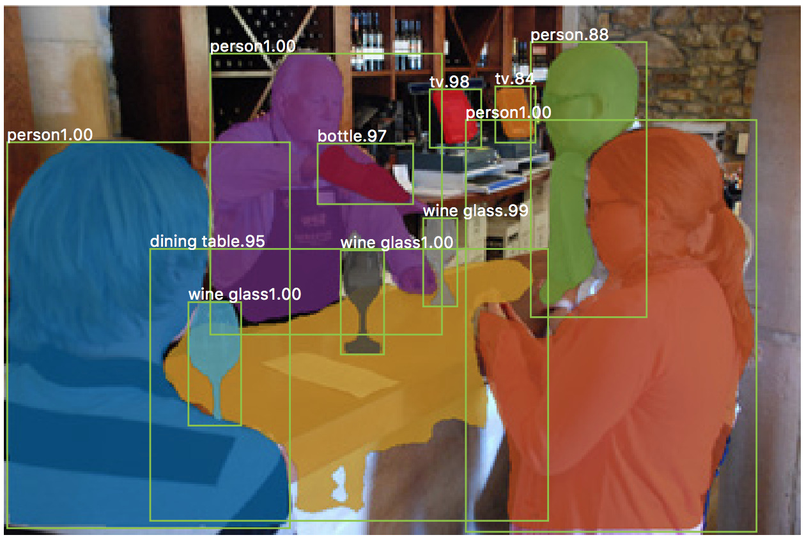
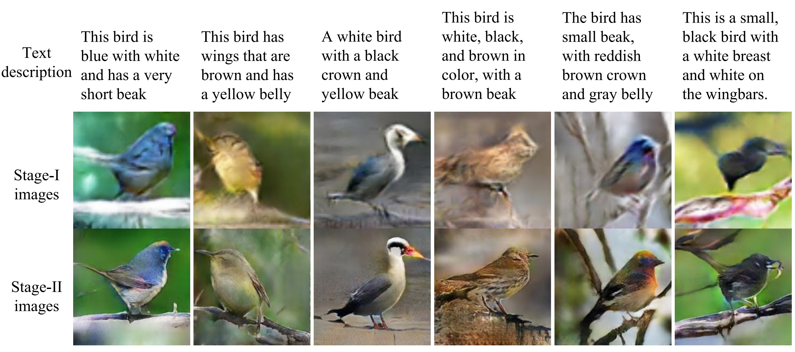
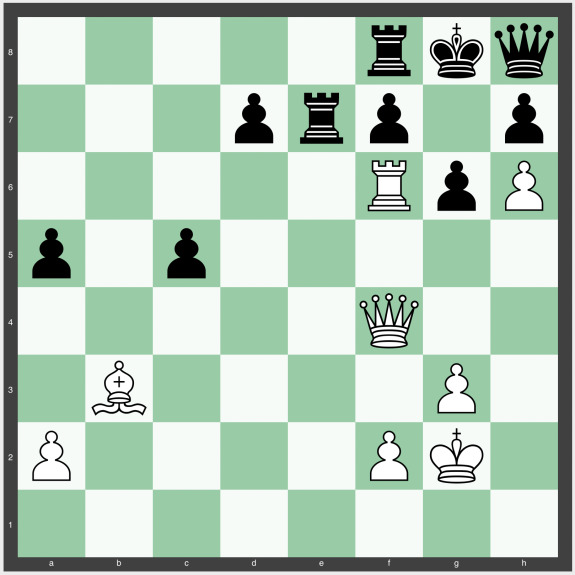

**A 2020-as tavaszi félév (tervezett) programja**

- 2020\. 02\. 12\. [Bevezető, kedvcsináló](docs/elte-deeplearning-starter-2020.pdf)
    + Előadó: Varga Dániel

- 2020\. 02\. 19\. [Deep Learning alapfogalmak](docs/dl2020_nn_bevezeto.pdf)
    + Előadó: Zombori Zsolt
    + [1\. Házi feladat](https://colab.research.google.com/drive/10a_O1RO3OZ3i6Jj_O8w0XScYJQcyiAyf#scrollTo=Oefmx5K2WCPk): Határidő március 8.

- 2020\. 02\. 26\. [Konvolúciós hálózatok](docs/dl2020_cnn.pdf)
    + Előadó: Csiszárik Adrián
    + [2\. Házi feladat](https://colab.research.google.com/drive/1LK-KFuyAiW39O1NX0YR8cvd8x5fr6nSp#scrollTo=-Oyd2Yyk94V7): Határidő március 11.

- 2020\. 03\. 04\. Optimalizálás neurális hálózatokban
    + Előadó: Csiszárik Adrián

- 2020\. 03\. 11\. Labor: Deep Learning programozási alapismeretek
    + Előadó: Zombori Zsolt
    + Laboron használt példaprogramok: [tutorial.py](lab/tutorial.py), [tutorial_regularize.py](lab/tutorial_regularize.py), [tutorial_batchnorm.py](lab/tutorial_batchnorm.py), [tutorial_conv.py](lab/tutorial_conv.py), [tutorial_siamese.py](lab/tutorial_siamese.py), [tutorial_callback.py](lab/tutorial_callback.py), [tutorial_metric.py](lab/tutorial_metric.py)
    + [3\. Házi feladat](https://colab.research.google.com/drive/1QgppKeLY_eL2JgHxy5Bl_uYfn1ucK9Ey): Határidő március 25.

- 2020\. 03\. 18\. Tavaszi szünet

- 2020\. 03\. 25\. Generatív modellezés (Generative Adversarial Networks)
    + Előadó: Varga Dániel
    + 4\. Házi feladat kiadása

- 2020\. 04\. 01\. Generatív modellezés (Variational Autoencoders)
    + Előadó: Kiss Melinda

- 2020\. 04\. 08\. Szekvencia Modellezés
    + Előadó: Zombori Zsolt

- 2020\. 04\. 15\. Természetes nyelv feldolgozás (NLP)
    + Előadó: Csanády Bálint
    + 5\. Házi feladat kiadása

- 2020\. 04\. 22\. Attention, Transformer, BERT
    + Előadó: Csiszárik Adrián

- 2020\. 04\. 29\. Megerősítéses tanulás
    + Előadó: Zombori Zsolt
    + 6\. Házi feladat kiadása

- 2020\. 05\. 06\. StyleGAN
    + Előadó: Varga Dániel

- 2020\. 05\. 13\. Öntanulás (Self supervised learning)
    + Előadó: Csiszárik Adrián

**Jegyszerzés módja**

A jegyszerzéshez a kiadott 6 házi feladatból legalább 5-öt el kell készíteni.

**Feltételezett előismeretek**

Lineáris algebrai alapismeretek, többváltozós analízis alapismeretek, python alapismeretek

A jegyszerzést megkönnyítő további előismeretek: gépi tanulás alapfogalmai, valószínűségszámítási alapismeretek, python tudományos programozás (numpy, scipy)

**Konzultáció**

Személyes konzultáció előzetes e-mail egyeztetés alapján

**Előadók:**
* Csiszárik Adrián: cs[keresztnev]@renyi.hu
* Lukács András: [vezeteknev]@cs.elte.hu
* Varga Dániel: [keresztnev]@renyi.hu
* Zombori Zsolt: [vezeteknev]@renyi.hu

* Benkő Beatrix: b[keresztnev]1010@gmail.com
* Czifra Domonkos: [keresztnev].[vezeteknev]@gmail.com
* Csanády Bálint: cs[keresztnev]@cs.elte.hu
* Kiss Melinda: [keresztnev]f[vezeteknev]@gmail.com

**Hosszútávú kutatási lehetőségek**

Az érdeklődő hallgatók számára lehetőséget biztosítunk
izgalmas kutatási projektekbe való bekapcsolódásra.

---

Alább kedvcsináló illusztrációk néhány sikeres deep learning rendszerről. Ezek, vagy egyszerűbb változataik a szemináriumon is bemutatásra kerülnek majd.

A [Mask R-CNN](https://github.com/matterport/Mask_RCNN) képszegmentáló:

---

A [StackGAN](https://github.com/hanzhanggit/StackGAN) szöveget képpé alakító rendszer:

---

Látens térbeli szemantikus képmanipuláció. Illusztráció a FaceApp-ból:

---

Az AlphaZero négy órával a sakk szabályainak megismerése után legyőzi a sakkvilágbajnok Stockfish programot. AlphaZero világossal lép:

